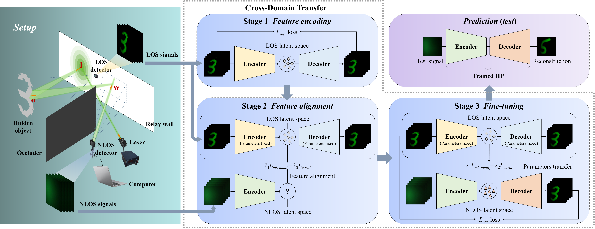

# A hybrid perceptron with cross-domain transferability towards active steady-state non-line-of-sight imaging
## Introduction
This is an official PyTorch implementation of **"A hybrid perceptron with cross-domain transferability towards active steady-state non-line-of-sight imaging"**. Datasets and source code are available here. If you find this work is useful, please give it a star ⭐ and consider citing this paper in your research. Thank you!



## Dependencies and Installation

To set up the environment, please make sure you have Python 3.7 (or higher) and the following dependencies installed:

- **Python 3.7** or higher
- **Pytorch 1.8** or higher

## Datasets
Datasets used in this work include both synthetic and real-world data. The rendering pipeline for the synthetic dataset is based on [1]. The real-world dataset contains 4,620 non-line-of-sight (NLOS) image pairs captured from real-world scenes. The data includes 660 digits (ranging from 0 to 9) from the MNIST handwritten digit database, all manufactured using 3D printing technology. Out of these, 4,200 pairs are used for training/validation, and 420 pairs are used for testing/evaluation. Download the real-world dataset here [https://github.com/RL-NLOS/NLOS_HP-CDT/releases].

### Datasets structure
```text
NLOS_real-world_datasets/
├── CDT-training_phase1/
│   └── Auto_encoding/
│       └── LOS_signal/
│           ├── im00000.png
│           ├── im00001.png
│           └── ... (4,200)
├── CDT-training_phase2/
│   └── CDT/
│       └── NLOS_signal/
│           ├── im00000.png
│           ├── im00001.png
│           └── ... (4,200)
├── CDT-training_phase3/
│   └── CDT_for_fine-tuning/
│       ├── NLOS_signal/
│       │   ├── im00000.png
│       │   ├── im00001.png
│       │   └── ... (4,200)
│       └── LOS_signal/  # Ground truth
│           ├── im00000.png
│           ├── im00001.png
│           └── ... (4,200)
└── test&eval/
    ├── test/
    │   ├── im00000.png
    │   ├── im00001.png
    │   └── ... (420)
    └── ground_truth/
        ├── im00000.png
        ├── im00001.png
        └── ... (420)
```

### Train / Evaluate
This dataset is designed for Active Steady-State NLOS Imaging and supports the training pipeline based on a three-stage cross-domain transfer (CDT) learning strategy. The purpose of each phase is as follows:

📌 **Phase 1: Auto-Encoding on LOS Signals (corresponding to the Stage 1 in the paper)**  
**Path**: CDT-training_phase1/Auto_encoding/LOS_signal/  
**Purpose**: Train an autoencoder model to capture the structural priors of Line-of-Sight (LOS) signals.  
**Quantity**: 4,200 LOS images.  
**Description**: All images are collected from visible scenes to learn the basic visual representations.  

📌 **Phase 2: Cross-Domain Pretraining on NLOS Signals (corresponding to the Stage 2 in the paper)**  
**Path**: CDT-training_phase2/CDT/NLOS_signal/  
**Purpose**: Adapt the model to the distribution of LOS images through unsupervised learning, enhancing the encoder's cross-domain generalization ability.  
**Quantity**: 4,200 NLOS images.  
**Description**: This phase does not rely on labels and is solely intended for feature pre-adaptation training.  

📌 **Phase 3: Fine-Tuning with Paired NLOS–LOS Signals (corresponding to the Stage 3 in the paper)**  
**Paths**:  
Input: CDT-training_phase3/CDT_for_fine-tuning/NLOS_signal/  
Labels: CDT-training_phase3/CDT_for_fine-tuning/LOS_signal/  
**Purpose**: Perform supervised fine-tuning with paired NLOS inputs and LOS ground truth images to optimize the quality of the decoder output.  
**Quantity**: 4200 image pairs (input + label).  
**Description**: This phase is used to further improve the reconstruction quality.  

**The training dataset can be split into 80% for training and 20% for validation or others depending on the use case.**  

📌 **Test & Evaluation**  
**Paths**:  
Test images: test&eval/test/  
Ground truth images: test&eval/ground_truth/  
**Purpose**: Validate the model's performance on unseen samples.  
**Quantity**: 420 image pairs.  
**Description**: Real NLOS test samples and their corresponding ground truth images for final evaluation and visual comparison.  

## Citation
If you find this code or dataset helpful, please cite the following paper:

```bibtex
@article{LIANG2025110072,
title = {A hybrid perceptron with cross-domain transferability towards active steady-state non-line-of-sight imaging},
journal = {Signal Processing},
volume = {237},
pages = {110072},
year = {2025},
issn = {0165-1684},
doi = {https://doi.org/10.1016/j.sigpro.2025.110072},
url = {https://www.sciencedirect.com/science/article/pii/S0165168425001860},
author = {Rui Liang and Xi Tong and Jiangxin Yang and Yanpeng Cao}
}
```

## References
[1] W. Chen, S. Daneau, F. Mannan, F. Heide, Steady-state non-line-of-sight imaging, in: Proceedings of the IEEE/CVF Conference on Computer Vision and Pattern Recognition (CVPR), 2019, pp. 6783–6792. doi:10.1109/CVPR.2019.00695.
